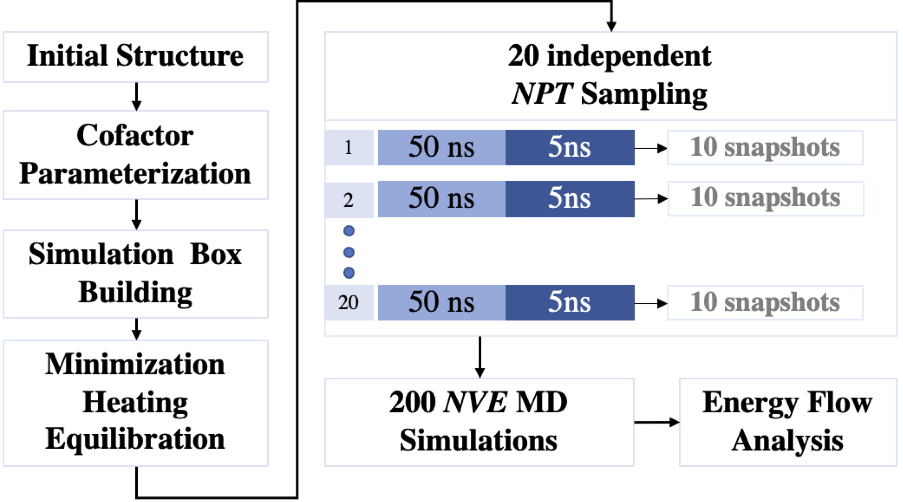

### Equilibrium MD Simulations

#### System setup for MD simulations
The thermal and energy transport properties of villin headpiece, HP36, were studied by MD simulations based on the nuclear magnetic resonance (NMR) structure (PDB code: 1VII) by using Amber package and AmberTools 19.
The protonation states of all ionizable residues were kept in their neutral solution states at pH = 7.
We used a small time step for MD simulations for generating time series of the heat current and energy flow.
Thus, we keep the system size as small as possible in this study.
After the protein molecule was solvated by a truncated octahedral box of TIP3P water molecules with 2 sodium and 4 chloride ions, the total number of molecules for the simulation box was 7589.
Amber ff19SB force field was used for protein molecule.
For efficient long-range electrostatic calculations, the particle mesh Ewald (PME) method was used under periodic boundary condition.

## COMPUTATIONAL METHODS

{#fig:method width=100%}

The computational procedures are summarized in @fig:method.

### Protein Structures.
We constructed two models of ferric FixLH
dimer, (1) the ligand-free state (met-FixLH) and (2) the imidazole-bound
state (met-FixLH-imd), based on the X-ray crystallographic structure of
FixL dimer. It is known that the deletion of the transmembrane region
from *Rm*FixL, which corresponds to the PAS-A domain of *Bj*FixL, gives
rise to no significant defect in the signaling functions.[@shiro2002]
Besides,
the A'α and Jα helices are involved in the formation of the dimer
interface, and considering the potential influence of the FixLHs dimer
interface on the signaling process, 142 residues from E128 to L269 are
considered in the subsequent MD simulations.

### MD Simulations
For both protein structures, the N- and C-
termini were capped with uncharged ACE (acetyl) and NME (N-methylamine)
groups, respectively. For both systems, we modeled the histidines H235
and H259 (H144, H150, H162, H200, H214) as neutral forms with each
epsilon (delta) nitrogen protonated. All other residues were considered
in their standard protonation state at pH = 7.0. The systems were
solvated with the TIP3P[@price2004] water molecules in a periodic cubic box, and
sodium ions were used to neutralize the systems, then, additional Na
and Cl ions were added to achieve a salt concentration of \~ 0.15 M.
Each solvated system contains about \~ 60, 000 atoms.

All molecular simulations were performed by Amber 14. The Amber
ff14SB force field[@maier2015] was used to model the standard residues of the
proteins except for H200, tuned force field from quantum calculations at @sec:parameterization was used to
model the heme, ligands, and H200.

The long-range electrostatic
interactions were treated with the particle mesh Ewald method[@essmann1995] and
nonbonded particle-particle interactions[@duan2001] were considered using a 9.0
Å cutoff. The time step for all MD simulations was set as 2.0 fs and
SHAKE was used to constrain hydrogens for product run MD simulations. To
prevent the dissociation of A'α helices, a harmonic restraint with a
spring force of 10 kcal/mol·Å^2^ was applied on the bond between two CA
atoms of residue I128 of chain A and chain B.

 After minimization,
heating, and equilibration of the systems (SI Appendix has a full
description of the procedures of this section), 20 independent *NPT* MD
simulations were performed for 55 ns at conditions of *T* = 300 K and
*P* = 0.978 atm, to conduct the conformational samplings. From the last
5-ns trajectory of each *NPT* simulation, 10 snapshots with their atomic
coordinates and velocity information were saved every 0.5 ns, from each
of which we conducted 200 sets of independent 1-ns constant volume,
constant energy (*NVE*) MD simulations. The atomic coordinates and
velocities of *NVE* MD simulations were saved every 10 fs for the
further calculations of energy flow and energy conductivity of native
contacts.

### Analysis of Energy Flow
We evaluated a measure of energy
transport, denoted by *G*, between each pair of residues in native
contact[@yamashita2018] using the *CURrent calculations in Proteins* (CURP) program
developed by our lab (<https://curp.jp>).[@ishikura2012;@leitner2009;@yamato2022]
The derivation
process of *G* is as follows. The energy flow between two atoms can be
described using the equation:

$$
\bm J_{i \leftarrow j}^{k}(t) = \frac{1}{2}( \bm v_{i} \cdot \bm F_{ij} - \bm v_{j} \cdot \bm F_{ji})
$$

where *k* (= 1, 2, 3, ..., 200) is used to mark different trajectories
from *NVE* simulations; $J_{i \leftarrow j}^{k}$ is the inter-atom
energy flow between atom *i* and atom *j* for trajectory *k*; $v_i$
and $\bm v_j$ are the velocities of atom *i* and atom *j*, respectively;
$\bm F_{ij}$($\bm F_{ji})$ is the force from atom *j*(*i*) to atom *i*(*j*).
Then, the inter-residue energy flow can be calculated by:

$$
\bm J_{A \leftarrow B}^{k}(t) = \sum_{i \in A}^{N_{A}}{\sum_{i\in B}^{N_{B}}{\bm J_{i \leftarrow j}^{k}(t)}}
$$

where *N* is the total number of side-chain atoms in residue A or B;
atoms *i* and *j* belong to the side chain of residue A and B,
respectively. To calculate *G*, the equation of was used[@ota2019;@ishikura2015;@leitner2009]

$$
G_{AB}^{k} = \lim_{\tau \rightarrow \infty} \int_{0}^{\tau} \langle \bm J_{A \leftarrow B}^{k}(0) \cdot \bm J_{A \leftarrow B}^{k}(t)  \rangle dt
$$

Finally, the values of *G* were averaged,

$$
G_{AB} = \frac{1}{N_{traj}}\sum_{k = 1}^{N_{traj}}G_{AB}^{k}
$$

where *N*~traj~ = 200.[@ota2019;@leitner2009;@leitner2020a]

In this study, the $\tau$ was set as 50ps. We only
considered the sidechain pairs whose shortest interatomic distance is
within 6 Å because energy transport becomes negligible for the pairs
separated father than this threshold.

Here, we assume that the effective range of cross-correlation 
is limited to only between adjacent residues along the 
polypeptide chain.
According to @sec:method-cross-correlation,
 the cross-correlation term was calculated and plotted in 
 [@fig:cross].
Interestingly, we recognized the 
secondary structure dependence of the cross-correlation effect,
 i.e., the $\alpha$-helical regions are less affected by the
  cross-correlation.
At the moment, the reason for this observation is unclear.
Further study on the secondary structure dependence
 of the thermal transport property of proteins will be
  reported elsewhere.

![Contribution factors with cross-correlation correction. 
See the caption to [@fig:heat_before]](figures/cross/heat-conductivity-after-corrected.jpeg){#fig:heat_after}

After the allocation of the cross-correlation terms, all of the contribution factors decreased.
The corrected contribution factors were plotted in 
[@fig:heat_after], which exhibits similar patterns with [@fig:heat_before], and the total intra-residue contribution (0.75) was about three times as much as that of the inter-residue contribution (0.26).

To quantitatively verify the short-range cross-correlation
 assumption, we also calculated the second nearest
  cross-correlation between residue $\alpha$ and $\alpha+2$
   ($\xi_{\alpha, \alpha+2}$) using the same method described 
   in @sec:method-cross-correlation.
The total value of contribution factors due to 
the second nearest cross-correlation was 0.03 
(Table S2) whereas that for the nearest cross-correlation 
was $-0.62$ (Table S1), indicating that the second nearest 
cross-correlation has small impact on the overall heat current.

To examine the validity of linear-homopolymer-like model,
 we compared the time-integrated ACF between $\Lambda$ 
 and $\tilde \Lambda$, the former is derived for the exact
  heat current of the entire molecule, 
  while the latter the linear-homopolymer-like model.
The calculation results showed that $\tilde \Lambda$ 
is overestimated only by 0.9% than $\Lambda$, inducating
 that the linear-homopolymer-like model can successfully
  represent the thermal transport property of the entire
   molecule.

Using site-selective heat current analysis based on the linear-homopolymer-like model, we are allowed to evaluate the local thermal conductivity residuewise.
[@fig:residue_type] shows the residue-type dependence of the intra-residue contribution factors ([@fig:residue_type]).
The residue volume, $V_{\alpha}$, of residue $\alpha$ was obtained as the summation of atomic volume of the constituent atoms.
We used the average value of the residue volume using five representative structures of HP36 in thermal equilibrium at _T_ = 300 K by using VLDP web server.[@esque2013]
We recognize that the values of $\tilde c$ are proportional to the residue volume.
Also, the slope of the linear regression line depends on residue-type, indicating that the value of residue-wise thermal conductivity is sensitive to the residue type and their order decreases in the order of charged, polar, and hydrophobic residues.
The residuewise thermal conductivity $\lambda_{\alpha}$ of residue $\alpha$ is defined as $\tilde\Lambda_{\alpha,\alpha}/(3V_{\alpha}k_B T)$, in consistent with the report that the thermal diffusion along the $\alpha$-helix composed entirely of polar residues is faster than that of non-polar residues.[@mino2014] 

It has been accepted that the density is one of the important determinants of the thermophysical properties of materials.
The product of material density ($\rho$) and its specific heat ($c_p$), $\rho{c_p}$, is sometimes used as a measure of thermal energy storage capacity.[@bergman2011]
Regarding macroscopic property of homogeneous material, it is known that the denser the medium is, the larger its thermal conductivity becomes.
According to the literatures, for example, the value of thermal conductivity is 0.44 $\mathrm{W{/} (m{\cdot}K)}$ for high density polyethylene and 0.3 $\mathrm{W{/} (m{\cdot}K)}$ for low density polyethylene, respectively.[@xue2019]
In contrast, within heterogeneous materials such as protein molecules, the local density should vary from one site to another.
To examine the relationship between the local density and thermal conductivity, a scatter plot of the residue-wise thermal conductivity vs local density of each residue is shown in [@fig:density].
The local mass density ([@fig:density]a, b) ranges from 1.20 ~ 1.70 $\rm{g/cm^3}$, somewhat having a wider range than those experimentally determined average protein density, 1.39 ~ 1.44 $\rm{g/cm^3}$, and theoretical determined values, 1.35 ~ 1.44 $\rm{g/cm^3}$.[@fischer2009]
This is because that the volume of amino acid residues differs from buried and exposed states, resulting in a wider variety of residue density distribution ([@fig:residue_type]).[@harpaz1994;@baud1999] 

Regression analysis with cross-correlation correction (panel a) indicated that $\lambda$ is proportional to the residue mass density, although the slope is not so steep (i.e., weak density-dependence) with a broad distribution of the data points.
Statistically speaking, the correlation between two variants with a $p$-value less than 0.05 is considered statistically significant.
Their Pearson correlation coefficient and the $p$-value are 0.3 and 0.078, respectively, indicating that their correlation is not significant.
Instead, In panel b, the slope of the linear regression lines of hydrophobic and polar residues are almost flat, i.e., constant $\lambda$, while charged residues exhibited negative proportionality, the reason for which is unclear.
One possibility is that the charged residues tend to have relatively larger volumes than the other types of residues.[@harpaz1994] Besides, as can be seen in panel b, the $\lambda$ of polar residues is about twice that of hydrophobic residues.
This result is highly consistent with the observation of two times faster heat diffusion in the polar residue $\alpha$-helix than that in the non-polar residue $\alpha$-helix.[@mino2014]

For the HP36 protein, the subtotal contribution factor, $\tilde c$, of charged, polar, and hydrophobic residues were 0.32, 0.17, and 0.23, respectively.
Although the proportion of the charged and hydrophobic residues in this protein molecule were 10/36 and 18/36, indicating the contribution from the former dominates over the latter.

In molecular biophysics, vibrational energy relaxation of proteins has been a subject more familiar than the thermal transport property of proteins. In a pioneering study of excess energy dissipation in myoglobin [@mizutani1997], for example, Mizutani and Kitagawa demonstrated that the population of the $\rm \nu_4$ mode of the heme exhibit double exponential decay with the time constants of 1.9 and 16 ps after flash photolysis. Furthermore, they estimated the temperature relaxation times of the vibrational mode to be 3.0 and 25 ps,respectively, assuming Boltzmann distribution for the vibrational mode. We see that the picosecond dynamics play important roles in the temperature relaxation of a protein, which is associated with energy redistribution processes.

It is possible to estimate two parameters, i.e. the thermal diffusivity and temperature relaxation time, using the following equation[@bergman2011;@lervik2010;@kurisaki2023]

$$
\lambda = \frac{\rho c_pR^2}{\tau} = {\rho c_p} {\alpha}
$$
{#eq:eq20} 

where $\lambda$ is the thermal conductivity, $\tau$ is the relaxation time, $\alpha$ is the thermal diffusivity, $\rho$ is the protein desity, $c_p$ is the heat capacity, and $R$ is the effective radius of the protein, which is estimated from protein volume, $V = \frac{4 \pi R^3}{4}$.

The estimated value of $\tau$ is in the range of $8.4 \sim 13.9 \, \rm ps$, or the temeprature relaxation rate is in the range of $0.072\sim 0.119$ $\rm ps^{-1}$.
It should be noted that the reported values of vibrational energy relaxation time range from one to several tens of picoseconds.[@henry1986;@mizutani1997;@lervik2010;@sagnella2001;@bu2003;@fujisaki2005]
The estimated thermal diffusivity is 7.9 ~ 13.2 $\rm\AA^2{\, } ps^{-1}$, in good agreement with the values obtained from non-equilibrium MD simulations.[@botan2007;@nguyen2010]
The density of HP36 was calculated as $\rho$ = 1.57 $\rm{g \, cm^{-3}}$, a little larger than the widely used value (1.35 $\rm{g \,cm^{-3}}$).[@fischer2009]
The heat capacity was set in the range of 0.30 - 0.50 $\rm {cal \,g^{-1} \, deg^{-1}}$.[@gekko1979]

In the previous study on the thermal conductivity of hp36 protein,[@yamato2022] we used Amber ff14SB force-field for the protein atoms and TIP3P water model with the SHAKE constraints switched off, although it is an unusual usage of the TIP3P model.
It is known that anomalous diffusion occurs for simulations with the standard rigid TIP3P water model.[@wu2006;@takemura2007]
To examine the water-model dependence on the protein thermal conductivity, we used Amber ff19SB + TIP3P water model with the SHAKE constraints switched off only for protein in this study.
As mentioned above, the calculated value of $\lambda$ of the whole protein was 0.26 $\mathrm{\pm}$ 0.01 $\mathrm{W{/} (m{\cdot}K)}$, close to 0.3 $\mathrm{\pm}$ 0.01 $\mathrm{W{/} (m{\cdot}K)}$ obtained in the previous study.[@yamato2022] It is possible that the properties of solvent affect the protein thermal conductivity through the protein-solvent interfaces.

As described in the beginning of this chapter, the structure, dynamics and function of proteins are controlled by protein-solvent interactions. In particular, Straub, Leitner and coworkers reported seminal studies on the energy transport across the protein-water interfaces. Sagnella et al. observed spatially directed "funneling" of kinetic energy from heme to the surrounding solvent for the excess energy dissipation of myoglobin after flash photolysis.[@sagnella2001]
Agbo, Xu, Zhang, et al. examined the cytochrome c-water thermal conductance and demonstrated that the protein-water interface poses no greater Kapitza resistance to thermal flow than the protein itself.
It is interesting to note that the thermal conductance at the protein-solvent interfaces for different types and shapes of proteins exhibits different values of thermal conductance ranges from 100 to 330 $\rm MWK^{-1}m^{-2}$.[@lervik2010;@kurisaki2023;@xu2014;@agbo2014;@agbo2014a]
Hamzi et al. studied the dependence of the thermal conductance at the protein-water interfaces on the types of amino acid residues.[@hamzi2022]
As a result, they observed hydrophobic and aromatic amino acids tend to have a lower interfacial thermal conductance.
Not only the protein-water interface, but also other types of interfaces were also studied.
For example, ulrtrafast energy dissipation was observed from peptide helices to chloroform solvents on the 0.5 ps time scale, as a result of collaboration between experiment and theory.[@botan2007]

To understand how different water models would affect thermal boundary conductance, it would be helpful to consider the vibrational density of states of the protein and water.[@xu2014a;@agbo2014a]
In contrast to the previous study[@yamato2022], populations of some high frequency vibrational modes of solvents are missing in the present study with rigid TIP3P water model, leading to the decrease of thermal conductance at the protein-water interface.
Accordingly, it is possible that the vibrational energy distribution, especially for the surface amino acid residues near the protein-water interface, would be affected.
Also, it is possible that local heat capacities for such amino residues might be affected as well, leading to a change of protein thermal conductivity.
To verify such hypothesis, we need further examination.
Also, systematic studies on the influence of solvent models on the thermal transport properties of proteins and protein-solvent systems are needed to achieve more comprehensive understanding on the nature of protein-solvent systems.

The thermal transport property of an $\alpha$-helical protein (HP36) was investigated based on the linear response theory using equilibrium MD simulations.
The thermal conductivity ($\lambda$) of the entire molecule was calculated as 0.26 $\mathrm{\pm}$ 0.01 $\mathrm{W{/} (m{\cdot}K)}$ using AMBER ff19SB protein force field and rigid TIP3P water model, which is close to the that obtained using flexible TIP3P water model, indicating that the water model parameters do not alter the inherent thermal transport property of proteins.

To further investigate the local heat transport properties within protein interior, we first divided the entire molecule into 36 amino acid residues.
Then, we introduced a theoretical model called linear-homopolymer-like model.
We assumed that the heat flow mainly occurs along the polypeptide backbone as well as within each individual amino acid residue.
Also, we assumed that the cross-correlation of partial heat currents between different regions is limited only within short-range.
As a result, the model reproduced the exact value of the protein thermal conductivity, derived from the total heat current, within the accuracy of 1% error.

Interestingly, residuewise thermal conductivity demonstrated distinct residue-type dependence: their values decreased in the order of charged, polar, and hydrophobic residues.

$$
G_{strong} > \bar{G} + 2\sigma
$$

$$
\sigma = \sqrt{\frac{\sum (G_i - \bar{G})^2}{N}}
$$

$$

$$